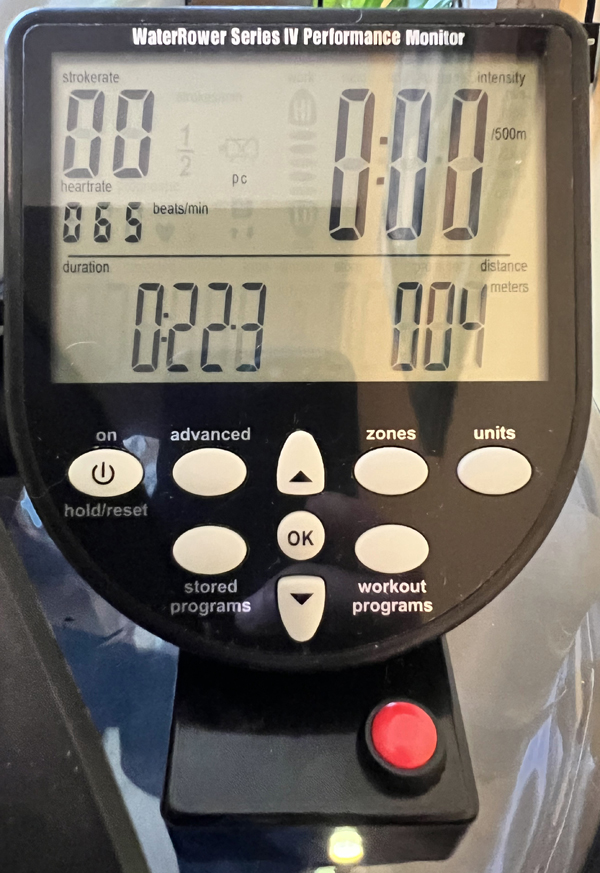
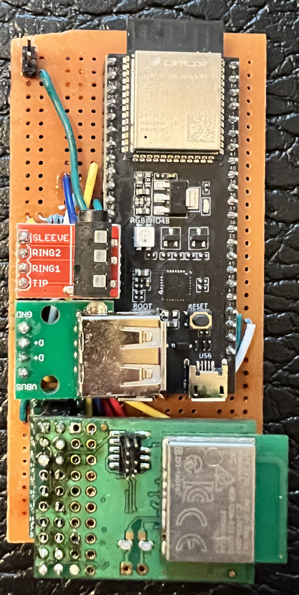
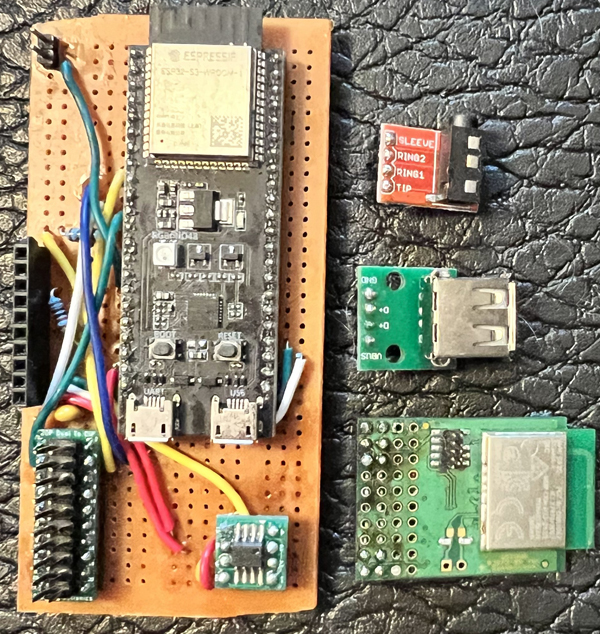
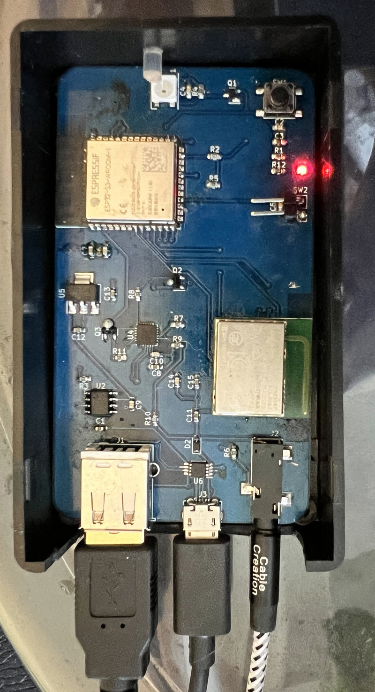
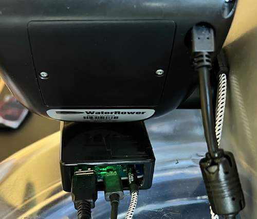

# WaterRower Link+

*THESE INSTRUCTIONS ARE A WORK IN PROGRESS.  PLEASE CONTACT ME THROUGH GITHUB IF YOU NEED HELP.*

## Description
WaterRower Link+ is a bluetooth module designed for any WaterRower with the S4 monitor.  It provides all the functionality of the official WaterRower ComModule as well as many additional features.

## Features
- Replaces WaterRower ComModule and External ANT+ Module
  - External ANT+ connection Works on M1 when using recommended cable (unlike the official ANT+ Plugin-In module!)
- Bluetooth
  - Bluetooth Fitness Machine Profile
    - Rower Data
    - Indoor Bike Data
  - Supports BLE HRMs
- ANT+
  - Fitness Equipment Profile
  - Supports ANT+ HRMs
- S4 monitor heart rate provider
  - Sends captured ANT+/BLE HR data for display on S4 monitor
- ANT+ to BLE HRM bridge
  - WRL+ will broadcast ANT+ HR data over BLE for use in apps that only support BLE. e.g. SuperNatural

## Tested Software
- WaterRower Connect
- Holofit
- VZFit
- ZWift
- Garmin Fenix 6
- SuperNatural (HR only)

## Hardware
Hardware design is available in the KiCad projects in this repo.  There are two versions, [breadboard](hardware/breadboard/) and [PCB](hardware/pcb/).  With the breadboard version, everything can be assembled using dev boards and jumper wires. [^1]  Both solderless and soldered breadboards were tested and work.  The PCB version requires the design be sent to a PCB manufacturer.  Either one can be a fun project depending on your skill level.

### Soldered Breadboard Version

### PCB Version

## Breadboard Bill of Materials
|Qty|Reference|Part|Foot Print|Supplier|
|---|---------|----|----------|--------|
|1|C1|1uF|THT||[Amazon](https://www.amazon.com/gp/product/B085RDTCCV)
|1|C2|0.1uF|THT||(See above)
|1|J1|AudioPlug3|2.54mm|[Amazon](https://www.amazon.com/gp/product/B07L3P93ZD)
|1|J4|USB_A|2.54mm|[Amazon](https://www.amazon.com/gp/product/B07MBSTZYG)
|2|R1, R2|10k|THT|[Amazon](https://www.amazon.com/gp/product/B072BL2VX1)
|1|SW2|Button|12mm|[Amazon](https://www.amazon.com/gp/product/B07F8GBWGG)
|1|U1|ESP32-S3-DevKitC-1|DIP|[Amazon](https://www.amazon.com/gp/product/B09CPNRDND)
|1|U2|LM3525M-H|SOIC-8|[Mouser](https://www.mouser.com/ProductDetail/926-LM3525MX-H-NOPB)
|1|U2|SOIC-8 TO DIP||[Amazon](https://www.amazon.com/gp/product/B07CJ96ZPW)
|1|U3|D52QD2M6IA[^2]|2x10_2.54mm|[Digi-Key](https://www.digikey.com/en/products/detail/garmin-canada-inc/D52QD2M6IA-A-TRAY/6149453)
|1||PCB Breadboard|50x100|[Amazon](https://www.amazon.com/gp/product/B07ZP4FYVJ)
|1|Project Box|B07W78LN1V|100 x 60 x 25|[Amazon](https://www.amazon.com/gp/product/B07W78LN1V)
|1|TRS Cable|CC0377|3.5mm|[Amazon](https://www.amazon.com/gp/product/B01K3WXQDW)
|1|USB Cable|3896|Mini USB|[Monoprice](https://www.monoprice.com/product?p_id=3896)

## PCB Bill of Materials
|Qty|Reference|Part|Foot Print|Supplier|
|---|---------|----|----------|--------|
|2|C1, C3|1uF cap|0603|[Amazon](https://www.amazon.com/gp/product/B06XDG3WQX)
|8|C2, C4, C5, C6, C9, C10, C14, C16|0.1uF cap|0603|(See above)
|2|C7, C11|C 10uF cap|0603|(See above)
|4|C8, C12, C13, C15|4.7uF cap|0603|(See above)
|1|D1|SK6812|5x5mm|[Digi-Key](https://www.digikey.com/en/products/detail/adafruit-industries-llc/1655/5154679)
|1|D2|1N5819|SOD-323|[Digi-Key](https://www.digikey.com/en/products/detail/micro-commercial-co/B5819WS-TP/2213555)
|1|D3|RED LED|0603|[Amazon](https://www.amazon.com/gp/product/B01CUGA380)
|1|J1|Molex_67643|USB-A|[Mouser](https://www.mouser.com/ProductDetail/538-67643-3910)
|1|J2|CUI_SJ-3523|3.5mm|[Mouser](https://www.mouser.com/ProductDetail/490-SJ-3523-SMT-TR)
|1|J3|Molex-105017-0001|Micro USB|[Mouser](https://www.mouser.com/ProductDetail/538-105017-0001)
|1|Q1|BSS138|SOT-23|[Mouser](https://www.mouser.com/ProductDetail/512-BSS138W)
|2|Q2, Q3|S8050|SOT-23|[Amazon](https://www.amazon.com/gp/product/B07KPCBP24)
|7|R1, R3, R4, R5, R6, R8, R11|10K res|0603|[Amazon](https://www.amazon.com/gp/product/B095P6L5PB)
|2|R2, R7|1K res|0603|(See above)
|1|R9|47K res|0603|(See above)
|1|R10|22K res|0603|(See above)
|1|R12|5.1K res|0603|(See above)
|1|SW2|Header|2x2.54mm|[Amazon](https://www.amazon.com/gp/product/B01461DQ6S) 
|1|SW2|Button|12mm|[Amazon](https://www.amazon.com/gp/product/B07F8GBWGG)
|1|SW4|RESET|2x2.54mm|(See above)
|1|SW1|RESET|6x6mm|[Amazon](https://www.amazon.com/gp/product/B077N3D7BD)
|1|SW3|BOOT|6x6mm|(See RESET)
|1|U1|ESP32-S3-WROOM-1|ESP32-S3-WROOM-1|[Mouser](https://www.mouser.com/ProductDetail/356-ESP32-S3WROOM1N8)
|1|U2|LM3525M-H|SOIC-8|[Mouser](https://www.mouser.com/ProductDetail/926-LM3525MX-H-NOPB)
|1|U3|D52Q|D52QD2M4IA|[Digi-Key](https://www.digikey.com/en/products/detail/garmin-canada-inc/D52QD2M4IA-TRAY/6149451)
|1|U4|CP2102N-Axx-xQFN24|QFN-24|[Digi-Key](https://www.digikey.com/en/products/detail/silicon-labs/CP2102N-A02-GQFN24/9863476)
|1|U5|AP7361C-33E|SOT-223|[Digi-Key](https://www.digikey.com/en/products/detail/diodes-incorporated/AP7361-33E-13/4249788)
|1|U6|SP0506BAATG|MSOP-8|[Mouser](https://www.mouser.com/ProductDetail/576-SP0506BAATG)
|1|Project Box|B07W78LN1V|100 x 60 x 25|[Amazon](https://www.amazon.com/gp/product/B07W78LN1V)
|1|TRS Cable|CC0377|3.5mm|[Amazon](https://www.amazon.com/gp/product/B01K3WXQDW)
|1|USB Cable|3896|Mini USB|[Monoprice](https://www.monoprice.com/product?p_id=3896)
|1|Light Pipe||RA|[Digi-Key](https://www.digikey.com/en/products/detail/dialight/51513620375F/9742144)

## PCB Ordering Instructions
I recommend using [JLCPCB](http://www.jlcpcb.com).  5 PCBs with a paste stencil and shipping for less than $20.  The cheapest shipping option takes about a month to arrive.
The gerber files needed for fabrication are included in the repo (hardware/pcb/*.gbr).  JCL PCB contacted me about which layer to use for the paste stencil (paste or solder mask).  The paste layer is correct for that.  I do not know why the footprints I used made that questionable but using the paste layer worked fine.

## PCB Assembly Tips
Watch YouTube tutorials on how to do SMD soldering. I had good luck using a stencil for the solder paste, laying out all components then using a mix of the hot plate and hot air to solder (with some touch ups with the iron).  This was my first SMD project and I was able to make it work with some patience.  The CP2012N, followed by the D52Q are the most difficult to solder.

## Cable Connections
1. Attach mini USB cable to S4 monitor and WaterRower Link+
2. Attach 3.5mm cable to S4 monitor and WaterRower Link+.  The recommended cable will fit in the narrow gap of an M1 rower and the monitor.
2. Attach micro USB cable to USB power supply

### Equipment Used
- Soldering Iron: [YIHUA 995D+](https://www.amazon.com/gp/product/B0919MS875)
- PCB Hot Plate: [MINIWARE MHP30M Mini Hot Plate](https://www.amazon.com/gp/product/B08R6XFPKR)
- PCB Holder: [Stickvise](https://www.stickvise.com/)
- Microscope: [AMScope SM745NTP-B](https://amscope.com/products/sm745ntp-b) + [DAB](https://amscope.com/products/DAB)

## Usage
Once power is provided, a red LED will illuminate on the board and should be detectable in apps.  Press the button connected to SW2 turn on the S4 monitor.  The NeoPixel will illuminate green when it detects it over the USB connection.  It will power off automatically after 30 minutes of inactivity.  When WRL+ is receiving data from the S4, the LED will turn cyan. When it detects a heart rate over BLE or ANT+, it will beat red.
Note the software only supports one HRM.  If multiple are detected, only the first one seen will be connected.

## Known Issues
- The last update to VZfit displays HR in the HUD however the value does not appear correct.  It may be a bug with WRL+ or VZfit.

## Where To Buy
Unfortunately this hardware is not for sale.  You must purchase the parts and build it yourself.  I had hoped to sell a few boards for fun but I later discovered things like this need some FCC testing (unintentional radiator) and that can run between $1,000 and $2,000—something I am not willing to spend as I will never recoup the costs.

## Credits
This project was inspired by [PiRowFlow](https://github.com/inonoob/pirowflo)

[^1]: The LM3525M must be soldered to the SOIC-8 TO DIP first
[^2]: This part is EOL at Digi-Key.  I do not know if there is a compatible replacement.