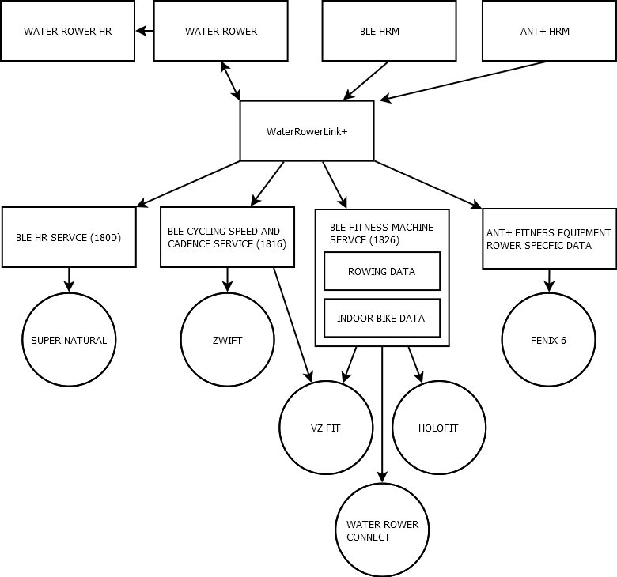

# WaterRower Link+

## Description
WaterRower Link+ is a bluetooth module designed for any WaterRower with the S4 monitor.  It provides all the functionality of the official WaterRower ComModule as well as many additional features.

## Features
- Replaces WaterRower ComModule and External ANT+ Module
  - Works on M1 (for HR display) when using recommended cable (unlike the official ANT+ Plugin-In module!)
- Bluetooth
  - Bluetooth Fitness Machine Profile
    - Rower Data
    - Indoor Bike Data
  - Supports BLE HRMs
- ANT+
  - Fitness Equipment Profile
  - Supports ANT+ HRMs
- S4 monitor heart rate provider
  - Sends captured ANT+/BLE HR data for display on S4 monitor

## Tested Software
- WaterRower Connect
- Holofit
- VZFit
- ZWift
- Garmin Fenix 6

## Hardware
Hardware design is available in the KiCad projects in this repo.  There are two versions, [breadboard](hardware/breadboard/) and [PCB](hardware/pcb/).  With the breadboard version, everything can be assembled using dev boards and jumper wires.  The PCB version requires the design be sent to a PCB manufacturer.  Either one can be a fun project depending on your skill level.

## Breadboard Bill of Materials

## PCB Bill of Materials
|Qty|Reference|Part|Foot Print|Supplier|
|---|---------|----|---------|------|
|2|C1, C3|1uF cap|0603||
|8|C2, C4, C5, C6, C9, C10, C14, C16|0.1uF cap|0603||
|2|C7, C11|10uF cap|0603||
|4|C8, C12, C13, C15|4.7uF cap|0603||
|1|D1|SK6812|||
|1|D2|1N5819|SOD-323||
|1|D3|RED LED|0603||
|1|J1|Molex_67643|||
|1|J2|CUI_SJ-3523||
|1|J3|USB_B_Micro|Molex-105017-0001||
|1|Q1|BSS138|SOT-23||
|2|Q2, Q3|S8050|SOT-23||
|7|R1, R3, R4, R5, R6, R8, R11|10K|0603||
|2|R2, R7|1K|0603||
|1|R9|47K|0603||
|1|R10|22K|0603||
|1|R12|5.1K|0603||
|1|SW1|RESET|Button_Switch_SMD:SW_Push_1P1T_NO_6x6mm_H9.5mm||
|1|SW2|S4|Connector_PinHeader_2.54mm:PinHeader_1x02_P2.54mm_Vertical||
|1|SW3|BOOT|Button_Switch_SMD:SW_Push_1P1T_NO_6x6mm_H9.5mm||
|1|SW4|RESET|Connector_PinHeader_2.54mm:PinHeader_1x02_P2.54mm_Vertical||
|1|U1|ESP32-S3-WROOM-1|ESP32-S3-WROOM-1|
|1|U2|LM3525M-H|SOIC-8||
|1|U3|D52Q|D52Q||
|1|U4|CP2102N-Axx-xQFN24|QFN-24||
|1|U5|AP7361C-33E|SOT-223||
|1|U6|SP0506BAATG|MSOP-8||
|1|Project Box|B07W78LN1V|100 x 60 x 25|[Amazon](https://www.amazon.com/gp/product/B07W78LN1V)
|1|TRS Cable|CC0377|3.5mm|[Amazon](https://www.amazon.com/gp/product/B01K3WXQDW)
|1|USB Cable|3896|Mini USB|[Monoprice](https://www.monoprice.com/product?p_id=3896)

## PCB Assembly Tips
Soldering SMD components is not as hard as you may think.  Never did I think I would be able to do so however after watching some YouTube tutorials I was able to even solder the QFN24 package.  Having said that, I do have more than a basic soldering iron at my disposal.

## Cable Connections

### Equipment Used
- Soldering Iron: [YIHUA 995D+](https://www.amazon.com/gp/product/B0919MS875)
- PCB Hot Plate: [MINIWARE MHP30M Mini Hot Plate](https://www.amazon.com/gp/product/B08R6XFPKR)
- PCB Holder: [Stickvise](https://www.stickvise.com/)
- Microscope: [AMScope SM745NTP-B](https://amscope.com/products/sm745ntp-b) + [DAB](https://amscope.com/products/DAB)

## Where To Buy
Unfortunately this hardware is not for sale.  You must purchase the parts and build it yourself.  I had hoped to sell a few boards for fun but I later discovered things like this need some FCC testing (unintentional radiator) and that can run between $1000 and $2000--something I am not willing to spend as I will never recoup the costs.

## Credits
This project was inspired by [PiRowFlow](https://github.com/inonoob/pirowflo)

## Help
Please [contact me](mailto:nickbits@gmail.com?subject=WaterRowerLink+Inquiry) for any assistance.  I would love to help someone make one!